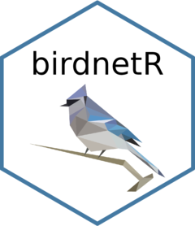

# birdnetR <a href="https://birdnet-team.github.io/birdnetR/"></a>

<!-- badges: start -->
[](https://lifecycle.r-lib.org/articles/stages.html#experimental)
[](https://github.com/birdnet-team/birdnetR/actions/workflows/R-CMD-check.yaml)
[](https://CRAN.R-project.org/package=birdnetR)
<!-- badges: end -->

`birdnetR` integrates [BirdNET](https://birdnet.cornell.edu/), a state‐of‐the‐art deep learning classifier for automated (bird) sound identification, into an R-workflow.
This package will simplify the analysis of (large) audio datasets from bioacoustic projects, allowing researchers to easily apply machine learning techniques—even without a background in computer science.

`birdnetR` is an R wrapper around the `birdnet` [Python package](https://github.com/birdnet-team/birdnet). It provides the core functionality to analyze audio using the pre-trained 'BirdNET' model or a custom classifier, and to predict bird species occurrence based on location and week of the year.
However, it does not include all the advanced features available in the [BirdNET Analyzer](https://github.com/birdnet-team/BirdNET-Analyzer). For advanced applications, such as training custom classifiers and validation, users should use the 'BirdNET Analyzer' directly.
`birdnetR` is under active development, and changes may affect existing workflows.


## Installation

Install the released version from CRAN:

```r
install.packages("birdnetR")
```
<br>
or install the development version from GitHub with:

```r
pak::pak("birdnet-team/birdnetR")
```

<div style="padding: 15px; margin-bottom: 20px; border: 1px solid #bce8f1; border-radius: 4px; background-color: #d9edf7; color: #31708f;">
<strong>Note</strong><br>
 Python dependencies are installed on demand, meaning they are installed when you use them for the first time. This will result in longer initial setup.
</div>


## Example use

This is a simple example using BirdNET to predict species in an audio file.

```r
# Load the package
library(birdnetR)

# Load a BirdNET acoustic model
model <- load_model()

# Path to the audio file (replace with your own file path)
audio_path <- system.file("extdata", "soundscape.mp3", package = "birdnetR")

# Predict species within the audio file
predictions <- predict(model, audio_path)

# Convert predictions to a data frame
df <- as.data.frame(predictions)

# Get most probable prediction within each time interval
get_top_prediction(df)

```


## Citation

Feel free to use `birdnetR` for your acoustic analyses and research. If you do, please cite as:

```bibtex
@article{kahl2021birdnet,
  title={BirdNET: A deep learning solution for avian diversity monitoring},
  author={Kahl, Stefan and Wood, Connor M and Eibl, Maximilian and Klinck, Holger},
  journal={Ecological Informatics},
  volume={61},
  pages={101236},
  year={2021},
  publisher={Elsevier}
}
```


## License

- **Source Code**: The source code for this project is licensed under the [MIT License](https://opensource.org/licenses/MIT).
- **Models**: The models used in this project are licensed under the [Creative Commons Attribution-NonCommercial-ShareAlike 4.0 International License (CC BY-NC-SA 4.0)](https://creativecommons.org/licenses/by-nc-sa/4.0/).

Please ensure you review and adhere to the specific license terms provided with each model. Note that educational and research purposes are considered non-commercial use cases.

## Funding

Our work in the K. Lisa Yang Center for Conservation Bioacoustics is made possible by the generosity of K. Lisa Yang to advance innovative conservation technologies to inspire and inform the conservation of wildlife and habitats.

The development of BirdNET is supported by the German Federal Ministry of Research, Technology and Space (FKZ 01|S22072), the German Federal Ministry for the Environment, Climate Action, Nature Conservation and Nuclear Safety (FKZ 67KI31040E), the German Federal Ministry of Economic Affairs and Energy (FKZ 16KN095550), the Deutsche Bundesstiftung Umwelt (project 39263/01) and the European Social Fund.

## Partners

BirdNET is a joint effort of partners from academia and industry.
Without these partnerships, this project would not have been possible.
Thank you!


