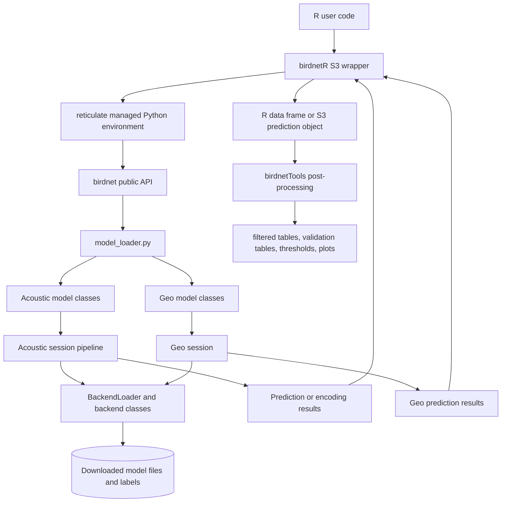
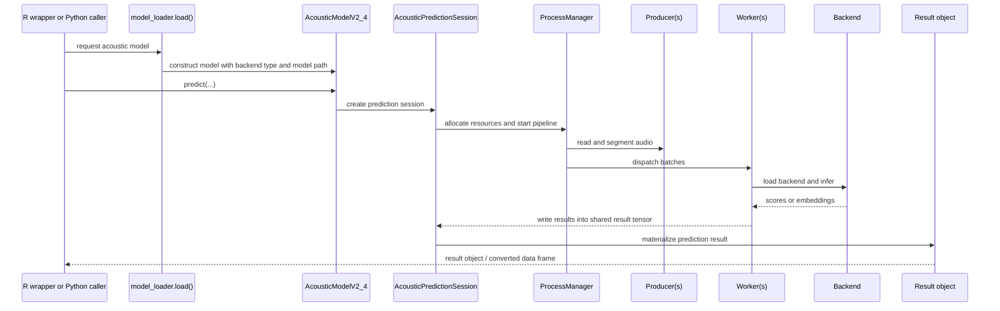
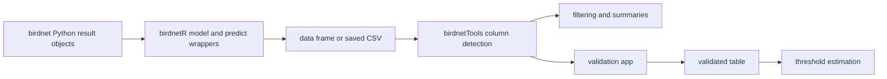

# BirdNET Python Package and `birdnetR` Bridge Architecture

## Overview

This note documents the current design of the upstream Python package `birdnet`
and the way `birdnetR` wraps it. It is intended for maintainers working on the
ongoing transition of `birdnetR` to the newer Python API.

The architecture has three practical layers:

1. The Python package `birdnet`, which owns model discovery, download, backend
   selection, acoustic and geo inference sessions, and result objects.
2. The R package `birdnetR`, which bootstraps a Python environment with
   `reticulate`, wraps Python model objects in S3 classes, forwards prediction
   calls into Python, and converts results back to R data frames.
3. The downstream R package `birdnetTools`, which does not call Python
   directly, but consumes BirdNET-style tabular outputs for post-processing,
   filtering, threshold selection, visualization, and manual validation.

This document is a snapshot of the code as of May 2026. It should be read as an
architecture guide, not as a promise that all wrapper paths in `birdnetR` are
fully aligned. In particular, `birdnetR` currently contains both a newer
wrapper path based on `birdnet.load()` and older wrapper code that still assumes
legacy `birdnet.models` module layouts.

## Scope and boundaries

In scope:

- Python public API and model loading in `birdnet`
- Backend and inference runtime structure in `birdnet`
- `birdnetR` package bootstrap, model wrapping, prediction dispatch, and result
  conversion
- Current transition hotspots between old and new wrapper code in `birdnetR`

Out of scope:

- Training workflows from BirdNET-Analyzer
- Python package internals of TensorFlow, LiteRT, or `reticulate`
- Generated pkgdown site output in `birdnetR/docs/`

## High-level architecture

## Python package design

### Public API surface

The top-level package surface is intentionally small. The main public exports are
assembled in `birdnet/src/birdnet/__init__.py`.

Important exported symbols:

- `load()`
- `load_custom()`
- `load_perch_v2()`
- `AcousticPredictionSession`
- `AcousticEncodingSession`
- `GeoPredictionSession`
- result classes for acoustic prediction, acoustic encoding, and geo prediction

The package expects most callers to start with `load()` or `load_custom()` and
then work with the returned model object's `predict()` or `encode()` methods.

### Model loading and validation

The central entry point is `birdnet/src/birdnet/model_loader.py`.

Responsibilities of `model_loader.py`:

- Validate model type, version, backend, precision, language, and path inputs
- Resolve official model downloads and label files
- Select the correct backend implementation class
- Dispatch to version-specific acoustic or geo model classes
- Support both official and custom models
- Expose a special `load_perch_v2()` path for the Perch model family

The loader relies heavily on constants in `birdnet/src/birdnet/globals.py`. That
module is the main source of truth for:

- valid model types: acoustic and geo
- valid versions
- valid backends: `tf` and `pb`
- valid precisions
- valid languages
- TensorFlow library selection: `tflite` vs `litert`
- custom-classifier options

### Backend abstraction

The backend system is defined in `birdnet/src/birdnet/core/backends.py`.

This module provides three architectural roles:

1. Abstract backend interfaces (`Backend`, `VersionedAcousticBackendProtocol`,
   `VersionedGeoBackendProtocol`)
2. Concrete backend families (`TFBackend` and `PBBackend` subclasses)
3. Loading and validation helpers via `BackendLoader`

Key architectural idea: model classes do not contain backend-specific inference
logic. They carry a `backend_type` and `backend_kwargs`, and sessions ask the
backend layer to instantiate and load the actual runtime object.

This separation lets `birdnet` vary:

- model type: acoustic vs geo
- file format: TensorFlow Lite / LiteRT vs protobuf
- precision
- device selection

without changing the high-level model API.

### Acoustic model layer

The main BirdNET acoustic façade is `birdnet/src/birdnet/acoustic/models/v2_4/model.py`.

`AcousticModelV2_4` is a lightweight configuration object around:

- `model_path`
- `species_list`
- whether the model is custom
- the backend class to use
- backend kwargs

Its main responsibilities are:

- `load()` and `load_custom()` constructors
- version-specific metadata such as sample rate, segment length, embedding size,
  and frequency bounds
- creation of explicit `encode_session()` and `predict_session()` objects
- simple convenience methods like `predict()` and `encode()` that wrap the
  session lifecycle

The acoustic model object does not itself run multiprocessing inference. It is a
factory for acoustic sessions.

### Acoustic inference pipeline

The acoustic runtime is the most complex subsystem. The main orchestration lives
in:

- `birdnet/src/birdnet/acoustic/inference/session.py`
- `birdnet/src/birdnet/acoustic/inference/process_manager.py`
- `birdnet/src/birdnet/acoustic/inference/resources.py`

Supporting components include:

- `birdnet/src/birdnet/acoustic/inference/configs.py`
- `birdnet/src/birdnet/acoustic/inference/core/producer.py`
- `birdnet/src/birdnet/acoustic/inference/core/worker.py`
- `birdnet/src/birdnet/acoustic/inference/prediction_strategy.py`
- `birdnet/src/birdnet/acoustic/inference/encoding_strategy.py`

Architecturally, the acoustic path is session-driven:

1. The model creates an `AcousticPredictionSession` or
   `AcousticEncodingSession`.
2. The session validates and stores a composed inference configuration.
3. `ResourceManager` allocates queues, semaphores, shared memory, ring buffers,
   and logging/performance resources.
4. `ProcessManager` starts the cooperating processes and threads.
5. Producers read or segment audio and feed batches into shared resources.
6. Workers load the selected backend and run model inference.
7. A strategy object assembles tensors and materializes the final result type.
8. The session tears down processes and shared memory on exit.

The acoustic code is intentionally split into strategy, resources, and process
orchestration so the same runtime machinery can support both prediction and
embedding extraction.

### Acoustic data flow

### Geo model layer

The geographic model path is much simpler than the acoustic one.

Main files:

- `birdnet/src/birdnet/geo/models/v2_4/model.py`
- `birdnet/src/birdnet/geo/inference/session.py`

`GeoModelV2_4` mirrors the acoustic model pattern at a smaller scale. It holds
model metadata and creates a `GeoPredictionSession`.

`GeoPredictionSession`:

- validates latitude, longitude, week, and confidence threshold inputs
- loads a backend through `BackendLoader`
- builds a single input tensor from `(latitude, longitude, week)`
- runs one backend prediction call
- masks species below the minimum confidence threshold
- returns a `GeoPredictionResult`

Unlike acoustic inference, there is no multi-process pipeline, ring buffer, or
producer/worker split.

### Model and label storage

The on-disk storage layout is managed in
`birdnet/src/birdnet/utils/local_data.py`.

This module defines where `birdnet` stores:

- downloaded model files
- language label files
- benchmark output

The root directory is OS-dependent and is resolved under the user's app-data
location. This storage layer is important for `birdnetR` because the R wrapper
usually delegates all model download and caching behavior to Python rather than
reimplementing it.

## `birdnetR` integration design

### Runtime bootstrap

The bridge into Python starts in `birdnetR/R/birdnetR-package.R`.

The `.onLoad()` hook does three important things:

1. sets `KERAS_HOME` to an R user directory
2. forces `reticulate` to use a managed Python environment
3. declares Python dependencies with `reticulate::py_require()` and lazily
   imports Python modules into package-level globals

Imported global handles include:

- `py_birdnet`
- `py_birdnet_globals`
- `py_pathlib`
- `py_builtins`

Architecturally, `birdnetR` does not vendor the Python implementation. It
expects the Python package to remain the execution engine.

### Model wrapper layer

The current preferred wrapper path lives in `birdnetR/R/model_load.R`.

`load_model()` and `load_custom()` are thin R façades over:

- `py_birdnet$load()`
- `py_birdnet$load_custom()`

The returned Python model object is wrapped in an S3 list by
`construct_model_class()`. The wrapper stores:

- `py_model`
- `model_type`
- `model_version`
- user-facing wrapper metadata such as `precision`, `language`, `library`, and
  custom model paths

The S3 class vector encodes multiple axes at once, for example:

- model type
- backend
- version
- whether the model is custom

This allows `birdnetR` to dispatch on higher-level R generics without copying
Python internals into R-native model classes.

### Prediction wrapper layer

The primary prediction bridge is in `birdnetR/R/predict.R`.

Acoustic prediction path:

- `predict.birdnet_model_acoustic()` calls `model$py_model$predict(...)`
- it adapts R arguments to the newer Python API naming, including:
  - `overlap` -> `overlap_duration_s`
  - `min_confidence` -> `default_confidence_threshold`
  - `min_confidence_custom` -> `custom_confidence_thresholds`
  - `species_list` -> `custom_species_list`
- it wraps the Python result in an S3 `birdnet_prediction_acoustic` object

Geo prediction path:

- `predict.birdnet_model_geo()` calls `model$py_model$predict(...)`
- it wraps the result in `birdnet_prediction_geo`

Result conversion:

- `as.data.frame.birdnet_prediction()` calls Python `to_dataframe()` and relies
  on `reticulate` conversion

This is a much thinner bridge than older `birdnetR` code because the Python
model objects now expose the main inference API directly.

### Option discovery and introspection

`birdnetR/R/model_options.R` derives supported options from
`py_birdnet_globals`, not from hard-coded R copies.

This is architecturally useful because it makes the R package consume Python's
current source of truth for:

- valid model types
- versions
- backends
- precisions
- library types
- languages

That design reduces drift, although some pruning logic still exists in R to
construct a user-facing options table.

### Optional Arrow conversion path

`birdnetR/R/install.R` and legacy code in `birdnetR/R/birdnet_interface.R`
introduce an optional Arrow-based conversion path.

The idea is to reduce R/Python conversion cost for large prediction results by:

- checking availability of R `arrow`
- ensuring Python `pyarrow` is available
- converting predictions to an Arrow table in Python before bringing them back
  into R

This is a boundary optimization, not part of the core model-loading design.

## Interface to `birdnetTools`

`birdnetTools` is a downstream consumer of BirdNET outputs, not another wrapper
around the Python package. Architecturally, the interface is data-oriented:

- `birdnet` produces result objects with tabular export methods
- `birdnetR` converts those results to R data frames or CSV files
- `birdnetTools` consumes those tables for further analysis and manual review

There is currently no direct package dependency from `birdnetTools` to
`birdnetR`, and no direct Python bridge inside `birdnetTools`. The integration
contract is therefore the detection table schema and associated audio-file
layout, not shared model objects.

### Interface shape

The key entry points in `birdnetTools` show that it expects BirdNET-like tables,
usually with columns corresponding to:

- start time
- end time
- common name or label
- confidence or score
- file path or file name

The column contract is intentionally flexible. `birdnetTools` detects columns by
pattern rather than by requiring a single exact schema. The main normalization
helper is `birdnetTools/R/utils_column_editing.R`, especially
`birdnet_detect_columns()`, which maps likely column names for:

- `start`
- `end`
- `scientific_name`
- `common_name`
- `confidence`
- `filepath`

This flexibility is important because `birdnetR` is still in transition between
older and newer result conventions. In practice, `birdnetTools` acts as a loose
consumer of BirdNET-compatible tables rather than a strict API client.

### Main downstream workflows

`birdnetTools` exposes four main kinds of downstream processing.

#### 1. Combining result files

`birdnetTools/R/birdnet_combine.R` reads BirdNET `.csv` or `.txt` outputs from a
directory tree and row-binds them into one table. This is the broadest
interface point because it can consume exported output files from either Python
BirdNET tools or `birdnetR` workflows that save prediction tables.

#### 2. Filtering and temporal enrichment

`birdnetTools/R/birdnet_filter.R` applies filtering by species, threshold,
year, date range, and hour. It depends on column detection rather than a strict
class contract.

For time-based filtering, `birdnetTools` often relies on file metadata derived
from filenames. `birdnetTools/R/utils_column_editing.R` provides
`birdnet_add_datetime()`, which parses datetimes from the detected `filepath`
column. This means that the downstream interface is not just the prediction
table, but also the naming convention of the audio files referenced in that
table.

#### 3. Validation workflow

`birdnetTools/R/birdnet_launch_validation.R` provides a Shiny validation app.
Its server logic reads a CSV selection table, identifies key columns, links rows
back to audio files in a selected folder, and supports manual review via:

- spectrogram rendering
- audio playback
- editable `validation` labels

For this workflow, the effective interface contract is stricter. The table must
contain enough information for `birdnet_detect_columns()` to locate:

- file path
- common name
- start time
- end time
- confidence

and the referenced audio files must be available on disk.

#### 4. Threshold estimation

`birdnetTools/R/birdnet_calc_threshold.R` calculates species-specific confidence
thresholds from validated detections. This establishes a feedback loop with
`birdnetR`:

1. generate detections upstream with `birdnet` or `birdnetR`
2. validate a sample in `birdnetTools`
3. estimate per-species thresholds in `birdnetTools`
4. feed those thresholds back into later filtering or analysis steps

### Architectural implications for `birdnetR`

The `birdnetTools` interface affects `birdnetR` design in a few ways.

1. Result export matters as much as in-memory wrappers. Even if `birdnetR`
   modernizes its internal bridge to Python, downstream compatibility still
   depends on stable or at least detectable tabular columns.
2. The `filepath` column is operationally important. `birdnetTools` uses it for
   datetime extraction and to reconnect detections to source audio.
3. `common_name`/`label`, `confidence`/`score`, and `start`/`end` naming drift
   is partly masked by `birdnetTools` column detection, but only within the set
   of patterns encoded in `birdnet_detect_columns()`.
4. A future cleanup in `birdnetR` should decide whether to guarantee a stable
   downstream schema explicitly, rather than relying on `birdnetTools` to infer
   it heuristically.

### Cross-package boundary summary

The interface between the packages can be summarized as:

This is a file-and-table boundary, not an object boundary.

## Transition hotspots and inconsistencies

This section is the main reason this note exists.

### New wrapper path vs old wrapper path

`birdnetR` currently contains two different integration styles.

#### Newer path

The newer path is based on the current public Python API:

- `birdnetR/R/model_load.R`
- `birdnetR/R/predict.R`
- `birdnetR/R/model_options.R`

This path assumes:

- users call `load_model()` or `load_custom()`
- Python model objects expose `predict()` directly
- Python globals provide valid options

This is the path that best matches the current structure of `birdnet`.

#### Older path

Older wrapper code remains in:

- `birdnetR/R/birdnet_interface.R`
- `birdnetR/R/module_map.R`

This older path assumes a different Python layout, including direct traversal of
`birdnet.models` submodules and constructors such as version-specific
`AudioModel...` classes. It also exposes older R entry points such as:

- `birdnet_model_tflite()`
- `birdnet_model_protobuf()`
- `birdnet_model_meta()`
- `predict_species_from_audio_file()`
- `predict_species_at_location_and_time()`

Those functions are still exported and documented, which means maintainers need
to treat them as compatibility surface during the migration.

### Bootstrap version mismatch

The dependency declaration in `birdnetR/R/birdnetR-package.R` still pins a GitHub
reference:

- `git+https://github.com/birdnet-team/birdnet@v0.2.0a0`

That is a transition risk if the intended target is newer `birdnet` behavior.
Any architecture or migration work should treat `.onLoad()` as part of the
integration contract, not just package setup boilerplate.

### Mixed public API in `birdnetR`

The current `NAMESPACE` exports both old and new loading/prediction APIs.
Examples:

- newer: `load_model()`, `load_custom()`, `predict()` methods
- older: `birdnet_model_tflite()`, `predict_species_from_audio_file()`

This means the R package is currently serving as both:

- a forward-looking wrapper around the newer Python package design
- a compatibility layer for older `birdnetR` user code

Any refactor should decide whether the architecture is meant to keep both layers
or collapse them onto one source of truth.

### Naming and result-shape drift

The package TODO and current wrappers suggest open questions around output
column naming and result conventions. The old API in
`birdnetR/R/birdnet_interface.R` performs more manual conversion and naming,
while the new API in `birdnetR/R/predict.R` delegates conversion to Python's
`to_dataframe()`.

This is an architectural choice point:

- either Python owns the result schema and R accepts it
- or R normalizes result schemas into a stable R-facing contract

The current codebase appears to be in between these positions.

## Recommended source-of-truth files

When updating the bridge, start with these files first.

### Upstream Python package

| Area | File | Why it matters |
|------|------|----------------|
| Public API | `birdnet/src/birdnet/__init__.py` | Shows the supported top-level API surface |
| Model loading | `birdnet/src/birdnet/model_loader.py` | Main entry point for loading official and custom models |
| Constants | `birdnet/src/birdnet/globals.py` | Source of truth for versions, backends, precisions, languages |
| Backend abstraction | `birdnet/src/birdnet/core/backends.py` | Defines how runtimes are selected and loaded |
| Acoustic model façade | `birdnet/src/birdnet/acoustic/models/v2_4/model.py` | Entry point from model object to session-based inference |
| Acoustic runtime | `birdnet/src/birdnet/acoustic/inference/session.py` | Best single file for the end-to-end acoustic lifecycle |
| Geo model façade | `birdnet/src/birdnet/geo/models/v2_4/model.py` | Entry point for geo predictions |
| Geo runtime | `birdnet/src/birdnet/geo/inference/session.py` | Shows the complete geo inference path |
| Storage layout | `birdnet/src/birdnet/utils/local_data.py` | Explains local model and label persistence |

### `birdnetR` bridge

| Area | File | Why it matters |
|------|------|----------------|
| Runtime bootstrap | `birdnetR/R/birdnetR-package.R` | Defines Python dependency resolution and imported module handles |
| Preferred model wrappers | `birdnetR/R/model_load.R` | Main R entry points for the newer Python API |
| Preferred prediction wrappers | `birdnetR/R/predict.R` | Main R dispatch path into Python model methods |
| Option introspection | `birdnetR/R/model_options.R` | Uses Python globals to expose valid configurations |
| Legacy compatibility path | `birdnetR/R/birdnet_interface.R` | Older wrapper API still exported to users |
| Legacy module mapping | `birdnetR/R/module_map.R` | Encodes assumptions about a pre-current Python module layout |
| Optional conversion support | `birdnetR/R/install.R` | Manages Arrow support at the R/Python boundary |

### `birdnetTools` downstream interface

| Area | File | Why it matters |
|------|------|----------------|
| File ingestion | `birdnetTools/R/birdnet_combine.R` | Combines exported BirdNET tables from directories |
| Column detection | `birdnetTools/R/utils_column_editing.R` | Defines the loose schema contract used downstream |
| Filtering | `birdnetTools/R/birdnet_filter.R` | Consumes BirdNET-like tables for species, threshold, and temporal filtering |
| Validation app | `birdnetTools/R/birdnet_launch_validation.R` | Uses detection rows plus source audio files for manual review |
| Threshold estimation | `birdnetTools/R/birdnet_calc_threshold.R` | Turns validated detections into species-specific thresholds |

## Maintainer guidance for the current migration

If `birdnetR` is being updated toward the newer `birdnet` API, the most likely
migration strategy is:

1. treat `birdnet/src/birdnet/model_loader.py` as the Python source of truth
2. treat `birdnetR/R/model_load.R` and `birdnetR/R/predict.R` as the preferred
   R façade
3. drive the transition with TDD: define the intended R API contract in tests
   before refactoring implementation details
4. keep the legacy compatibility surface for one release only and issue
   lifecycle warnings from wrapper functions and deprecated argument aliases
5. align `.onLoad()` dependency pinning with the actual Python version targeted
   by the wrapper code
6. minimize Python-to-R conversion and prefer Python-side export methods where
   the upstream result objects already provide them

The concrete migration checklist for this work lives in
`birdnetR/UPDATE_BIRDNET.md` and should be treated as the execution plan.

## Glossary

| Term | Definition |
|------|------------|
| Backend | Concrete inference runtime for a model, such as TensorFlow Lite / LiteRT or protobuf |
| Model façade | Lightweight object holding model metadata and creating sessions rather than doing heavy inference work directly |
| Session | Explicit inference lifecycle object that validates config, loads resources, and materializes results |
| Strategy | Acoustic pipeline component that decides how tensors are assembled and how results are produced |
| ResourceManager | Acoustic runtime component that allocates shared memory, queues, and synchronization objects |
| ProcessManager | Acoustic runtime component that starts and coordinates the multi-process inference pipeline |
| Bridge | The `birdnetR` layer that adapts R calls and objects to the Python `birdnet` package |
| Compatibility surface | Older exported R functions that still need to work during the API transition |

## Related package conventions

This document lives under `birdnetR/dev/` because it is maintainer-facing and
should not be built into the package artifact. That matches the existing
`.Rbuildignore` rule excluding `dev/` from package builds.
